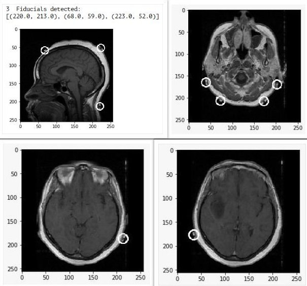

# Fiducial Localization
Fiducial Localization Project for InterIIT Tech Meet 2018.

The aim of this project is to autonomously find the location 
of fiducials in a 3D MRI scan of the brain. This will help 
doctors to determine the position of brain tumours faster.

Various other classmates with me on this project. I was primarily 
in-charge of designing the algorithm. We just used basic 
OpenCV functionality (thresholding, filtering) to achieve
the result. The result would have been better if we used CNNs. 
However, being only first year undergraduate students, we 
were not experienced in neural networks. That's why we chose 
this approach.

Our algorithm performed well on the final day. It was just a bit
less accurate than the CNN aproaches.

Sample output:  

## Contributors
The following people contributed to this project in various ways:

* Kartik Agrawal
* Rohan Kumar
* Anshuman Dwivedi
* Hit Vardhan
* Arya Das
